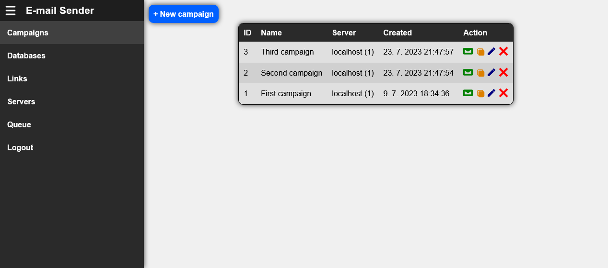

# E-mail Sender

  

This is a **bulk e-mail sender** and **campaign management** software featuring an API and web UI written in [**Deno**](https://deno.land/) (backend) and [**JavaScript**](https://www.ecma-international.org/publications-and-standards/standards/ecma-262/) (frontend).

You can easily manage your e-mail campaigns and send mass e-mails to your customers for purposes such as marketing campaigns, announcements, community newsletters and more.

It is designed to work well in [**Linux**](https://www.linux.org/) OS, but might work well on other OS too. The whole project is open source and free of charge.

## Table of Contents
1. [**Features**](#features)
2. [**Content**](#content)
3. [**Screenshots**](#screenshots)
4. [**Installation instructions**](#installation-instructions)
5. [**License**](#license)
6. [**Developer**](#developer)
7. [**Donations**](#donations)
8. [**Star History**](#star-history)

## Features
- Bulk e-mail sending capabilities
- Easy to use web UI for management of campaigns, servers, sendings, e-mail lists etc.
- Backend API

## Content

- **MySQL / MariaDB database** - The place where all the data are stored (campaigns, e-mail lists, e-mails to send, list of servers used for sending e-mails, list of the people who have unsubscribed their e-mail etc.)
- **E-mail Sender script** - This script periodically checks the "sending" table in the database for new email messages to be sent. This runs constantly on the server (we recommend that this should be running in the background in the screen application).
- **Web Server** - This multifunctional software encompasses:
  - **API** - For connecting web UIs (campaign management and unsubscribe page) with your database.
  - **Campaign management web UI** - Provides easy management of campaigns and other related tasks.
  - **Unsubscribe web UI** - To easily unsubscribe users from receiving your e-mails.

## Screenshots

## Installation instructions

- Please navigate to this page: [**Installation instructions**](./INSTALL.md)

## License

- This software is developed under the license named [**Unlicense**](./LICENSE).

## Developer
This software is developed by [**Liberland Software Foundation**](https://libersoft.org) - the first non-profit organization founded in [**Liberland**](https://liberland.org), dedicated to developing an innovative open source software.

If you're interested in joining our software development efforts, please [**contact us**](https://libersoft.org/contacts). We will be thrilled to have you onboard!

If you like our software, you can join our community on our [**social media**](https://libersoft.org/contacts). Your valueable feedback is highly appreciated.

## Donations

Donations are important to support the ongoing development and maintenance of our open source projects. Your contributions help us cover costs and support our team in improving our software. We appreciate any support you can offer.

To find out how to donate our projects, please navigate here:

Thank you for being a part of our projects' success!

## Star history

